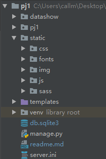

# Django 加载css、js、images等文件

## 环境

- windows10
- pycharm2017.3.3 professional edition(必须专业版)
- python3.6.4
- django2.0.2

## 参考资料

- [django 加载css文件和图片](http://blog.csdn.net/qq_21182587/article/details/69936510)

找了很多资料，就这个最全，使用最方便，感谢作者

## 方法

1. 创建项目
   参考[Django项目创建流程](https://blog.csdn.net/mildddd/article/details/79557937)
2. 打开django 项目，在项目的根目录或APP 下创建一个文件夹命名为static 用于保存css、js、images 等文件，templates 文件夹用于保存html 文件，路径如图，pj1为项目名称
   
3. 打开项目，在pj1/settings.py文件里寻找 TEMPLATES 选项，添加static文件
    ```python
    'DIRS': [os.path.join(BASE_DIR, 'templates'),
                os.path.join(BASE_DIR, 'static').replace('\\', '/')],
    ```
    在settings.py最底部添加

    ```python
    STATIC_ROOT = os.path.join(BASE_DIR, 'static').replace('\\', '/')
    STATICFILES_DIRS = (
        ('css', os.path.join(STATIC_ROOT, 'css').replace('\\', '/')),
        ('images', os.path.join(STATIC_ROOT, 'images').replace('\\', '/')),
        ('fonts', os.path.join(STATIC_ROOT, 'fonts').replace('\\', '/')),
        ('js', os.path.join(STATIC_ROOT, 'js').replace('\\', '/')),
    )
    ```
4. 修改urls.py文件在文件头添加

    ```python
    from django.contrib.staticfiles.urls import staticfiles_urlpatterns
    ```
    在文件尾部添加

    ```python
    urlpatterns += staticfiles_urlpatterns()
    ```

5. 修改HTML文件里面的路径

    导入css
    ```html
    <link href="/static/css/bootstrap.css" rel="stylesheet" type="text/css" media="all" />
    <link href="/static/css/style.css" rel="stylesheet" type="text/css" media="all" />
    ```
    导入js

    ```html
    <script src="/static/js/jquery-1.11.1.min.js"></script>
    ```
    插图

    ```html
    
    ```
